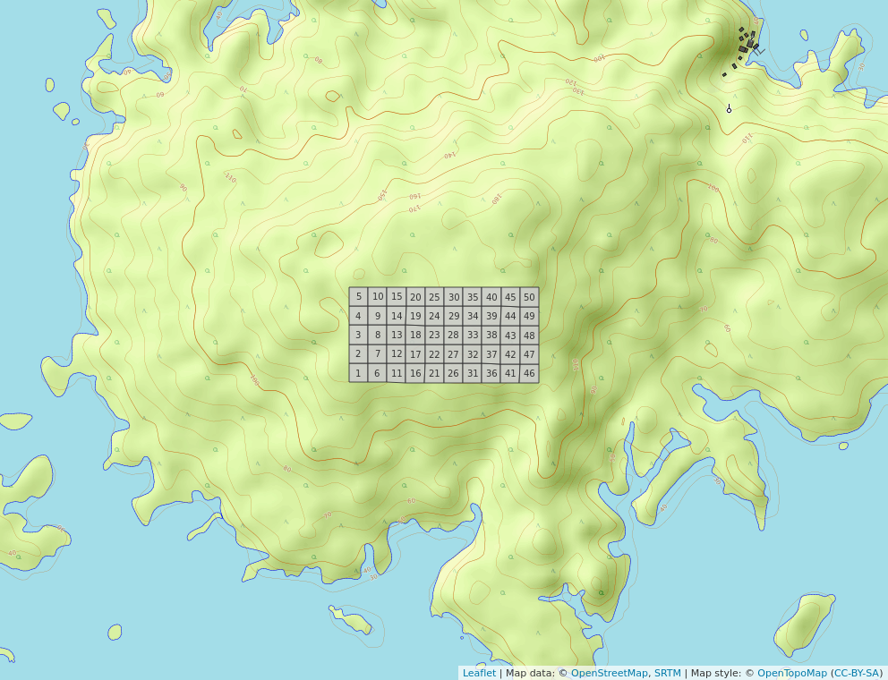
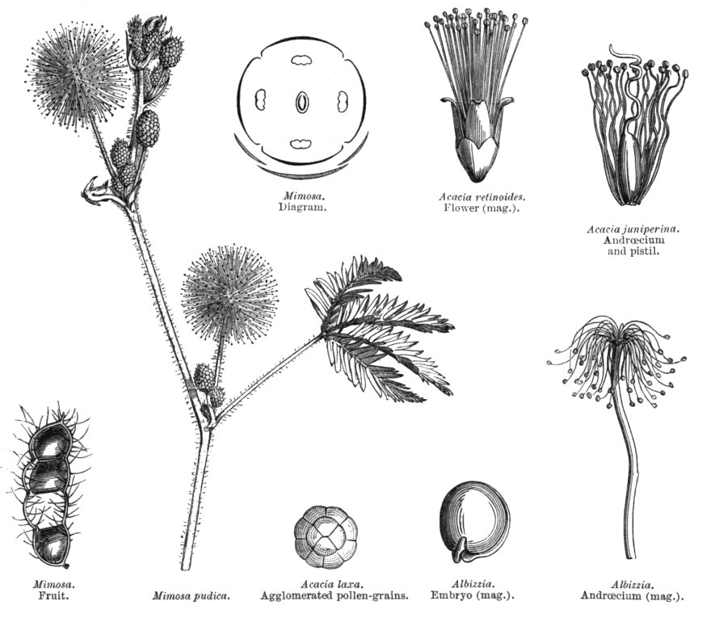
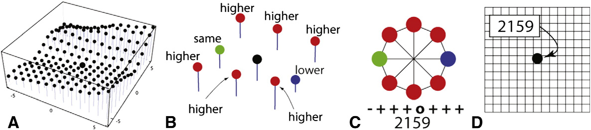
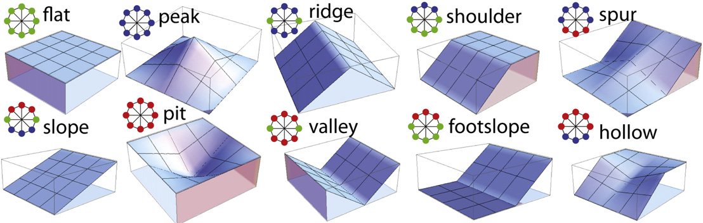

```{r, include=FALSE}
source("Cacatuo.R", local = knitr::knit_global())
```

# Introducción

El análisis de biodiversidad forestal viabiliza la obtención de información sobre el comportamiento de las especies en su hábitat, los efectos de cambios geoestacionarios, y las probables consecuencias de actividades antrópicas en el ciclo vital de los bosques; cuya función en el caso de los tropicales puede ser productiva (madera, fibra, leña, productos no maderables); ambientales (regulación del clima, reserva de biodiversidad, conservación de suelos y agua, etc.); y social (subsistencia de poblamientos humanos locales y su cultura) [@montagnini2005tropical].

La isla Barro Colorado (BCI), de coordenadas [9º 9' 0'' N, 79º 51' 0'' W], es una plataforma basáltica miocénica sobre la que descansa un bosque tropical primario compuesto por 305 especies arbóreas  [@condit1999dynamics]. Esta fue el emplazamiento de ocho censos forestales realizados por el Smithsonian Tropical Research Institute entre 1981 y 2015, donde la subfamilia *Fabaceae Mimosoideae* representó el 5.9% de las especies registradas en la parcela de 50 hectáreas delimitada en 1980 [Cita3,WebP]. 

![Isla Barro Colorado, Panamá [@inproceedings].](Map-of-Barro-Colorado-Island-BCI-Panama.png){width=50%}

El registro forestal de BCI forma parte de una serie de parcelas permanentes delimitadas en distintas latitudes y longitudes, pero dentro de la zona tropical. Estas parcelas poseen diferencias climáticas específicas con el objetivo de contabilizar, supervisar y medir variables demográficas que viabilicen realizar comparaciones atendiendo a cuestionamientos científicos, registro detallado del comportamiento en ecología vegetal o problemáticas resultantes de la intervención humana en el equilibrio natural [@condit1998tropical]. 


{width=50%}

Las fabaceas concentran su diversidad en la franja tropical y subtropical, aunque se encuentran ampliamente distribuidas por la práctica totalidad de climas terrestres. Están presentes en zonas árticas, litoral costero, ambientes alpinos, bosque lluvioso, bosque estacional, sabanas, bosque seco, desiertos áridos, pantanos y manglares. Poseen características especializadas que las hacen vitales para el equilibrio ecológico y para la supervivencia del ser humano. El 88% de las especies de esta familia pueden formar nódulos con bacterias fijadoras de nitrógeno (rhizobia) para fijar el N2 en la atmósfera mediante asociación simbiótica, fisiología rica en proteínas, etc. Asimismo, sus semillas son empleadas para tratar células cancerígenas, sus componentes químicos las hacen esenciales para diversos tipos de industrias, y el grano de las leguminosas representa el 33% del nitrógeno necesario en la dieta de los seres humanos [@saikia2020tropical].    

La subfamilia *Mimosoideae* dentro del clado mimosoide es sumamente variable, estando compuesta principalmente por árboles y arbustos de flores asimétricas cigomorfas. 


{width=50%}


El clado filogenético mimosoide es propio de climas tropicales y subtropicales, sus flores son simétricas con pétalos valvados y sus especímenes tienen un gran número de estambres prominentes [@hasanuzzaman2020plant]. En BCI se encuentran 18 de estas especies. 

Atendiendo a la flexibilidad en la distribución de las fabáceas, su importancia económica, y social; se busca entender qué factores ambientales intervienen en la proliferación, agrupamiento o decaimiento de sus poblaciones en bosques tropicales que comparten características con los hallados en República Dominicana, en esta ocasión tomando la data cincuentenaria recolectada y provista por The Center for Tropical Forest Science en BCI.

La ecología numérica es el campo de estudio que brinda las técnicas, índices, y herramientas necesarias para obtener conclusiones a partir de data forestal, animal, y biotopo. En ese sentido, R es un software de código abierto y ambiente de programación que brinda una amplia variedad de facilidades para el manejo, creación, y visualización gráfica de ciencia de datos [@venables2009introduction].

\ldots

# Metodología

Una vez obtenida la data censal de Barro Colorado, se empleó el software de código abierto R para realizar análisis estadísticos, gráficos, matrices, y mapas. 

Utilizando los paquetes *vegan*, *tydiverse*, y *sf* se extrajo la familia *Fabaceae Mimosoideae* de la data censal, se obtuvieron las estadísticas, gráficos lineales y diagramas de cajas. A través de *mapview* se crearon, proyectaron y almacenaron los mapas. *RColorBrewer* se empleó para obtener una gama de colores más amplia en los gráficos y mapas; *broom* para ver matrices de distancia. Otros paquetes empleados *magrittr*,  [@jose_ramon_martinez_batlle_2020_4402362].

***Podría crear una tabla para explicar brevemente el uso dado a cada paquete***

La caracterización geomorfológica se elaboró a partir del algoritmo r.geomorphons por @jose_ramon_martinez_batlle_2020_4402362 siguiendo el modelo de @jasiewicz2013geomorphons. (Ver figuras \ref{Geomorf3} y \ref{Geomorf2}) 

{width=100%}

{width=100%}


Diversos estudios fueron tomados en cuenta para la clasificación de hábitats, se empleó la categorización realizada por @harms2001habitat partiendo del resumen y análisis de la data compilada en 16,6 años, donde fueron tomados en cuenta árboles de 1 cm de diámetro a la altura del pecho. (Ver tabla \ref{tab:hábitat})


Table: Clasificación de hábitats, parcela permanente BCI [@harms2001habitat].\label{tab:hábitat}

| Hábitat                        | Pendiente (grados) | Elevación (metros) |
|--------------------------------|:------------------:|:------------------:|
| Bosque adulto - Meseta baja    |         <7         |        <152        |
| Bosque adulto - Meseta alta    |         <7         |      = o >152      |
| Bosque adulto - Pendiente      |       = o >7       |        Todas       |
| Bosque adulto - Área pantanosa |        Todas       |        Todas       |
| Bosque adulto - Ribera fluvial |        Todas       |        Todas       |
| Bosque joven                   |        Todas       |        Todas       |
| Hábitats mixtos                |        Todas       |        Todas       |


Mapas de ubicación, abundancia de individuos, riqueza de especies, agrupamiento de parcelas, pH, nitrógeno y otras variables presentes en el relieve, clima, y edafología del lugar se emplearon para determinar patrones asociativos entre las especies de fabáceas.   

Se determinó la asociación interespecífica y de sitios muestrales mediante los métodos R y Q respectivamente. En el modo Q se obtuvo mediante la métrica de distancia euclidea o similaridad de Jaccard, verificando la paradoja de orlóci (1978); transformación de cuerdas (*chord*); *ji*-cuadrado; y *Hellinger*. Mientras que en el modo R se calculó el índice de correlación de Pearson aplicando la transformación de *chi* para corregir alteraciones producidas por outliers en los datos; la matriz de comunidad transpuesta convertida a binaria (presencia/ausencia) para calcular distancia entre especies con la similaridad de Jaccard; y el índice *rho* de Sperman [@jose_ramon_martinez_batlle_2020_4402362]. 


\ldots

# Resultados

La parcela de 50ha en BCI posee 3847 individuos de la familia *Fabaceae Mimosoideae* agrupados en 18 especies distribuidas de forma aleatoria en 50 sitios de 1ha cada uno. La especie más abundante es *Inga Marginata* [767], seguida de cerca por *Inga Umbellifera* [765]; mientras que la más escasa es *Cojoba Rufescens* [2], seguida de *Inga Oerstediana* [4]. La abundancia especifica acorde a una organización ascendente por número de individuos presenta una mediana de 57 individuos [*Inga Punctata* e *Inga Laurina*], siendo la mitad más pobre de especies el equivalente a un 5.82% [224] y la mitad más presente el 94.18% [3623]. La riqueza de especies por cuadrante evidencia una distribución también desproporcional, el C26 presenta la riqueza más débil [5] y el C30 la más fuerte [13]. No obstante, aunque no existe relación directa entre la riqueza y la abundancia por cuadrante, en C26 coíncide y en algunos otros cuadros puede existir cierta aproximación.

(ver tabla \ref{tab:abun_sp} y figura \ref{fig:abun_sp_q})

```{r, echo=FALSE}
knitr::kable(abun_sp,
             longtable = FALSE,
             caption = "\\label{tab:abun_sp}Abundancia por especie de la familia *Fabaceae-Mimosoideae*.")
```

```{r, echo=FALSE, fig.cap="\\label{fig:abun_sp_q}Abundancia por especie por quadrat"}
abun_sp_q
```

El terreno eminentemente describe una geomorfología en vertiente, siendo esta característica la más destacada en el 88% de los C 1Ha; en tanto que el 12% restante describe una geomorfología donde predomina el relieve llano. La parcela madre está compuesta en un 52% por bosque adulto en meseta baja distribuido ampliamente, un 24% por bosque adulto en pendiente con presencia marcada en las parcelas [C41-C45], un 16% por bosque adulto en meseta alta concentrado en las parcelas [C3-C34; C37-C40], mientras que el 8% restante hábitat pantanoso y bosque jovén en forma equitativa. No parece existir una relación directa entre la morfología del espacio y un determinado hábitat, exeptuando el bosque joven que se encuentra tanto en llanura como en vertiente de forma considerable. En general, se percibe un leve aumento de la riqueza específica a medida que aumenta la abundancia de individuos; destacando la abundante riqueza de especies en el hábitat pantanoso, su pobreza en el bosque adulto en zona alta, la abundancia marcada el bosque adulto en zona baja y su riqueza equilibrada . (Ver Gráficos lineales 1 y 2).


Insertar Gráfs_Regresión_Lineal_aed_2.

----Podría interpretar mejor el boxplot----
*Sería interesante dedicar un acápite para la descripción de la composición mineral del suelo, hacer un ançalisis de las variables de elementos tomando en cuenta 5 C con más y 5 C con menos presencia. 


El grado de asociación según la similaridad de Jaccard acorde a la abundancia de especies por cuadro con matriz transformada *Hellinger* expone la existencia de clústers super semejantes limitados por los sitios C28-C33; C33-C40; C24-C2; C8-C10. Estos sitios comparten un 75% o más de las especies de acuerdo con la matriz ordenada en función de la relación de proximidad. (Ver mapa de calor 1).

***Insertar mapa de calor 1. aa_2_Modo_Q***
El color rosado intenso representa "mucha similaridad o distancia corta", mientras que el color azul intenso significa que los sitios están "muy alejados". 

La presencia de variables edáficas como minerales y otros elementos está asociada a la abundancia de especies en el clúster formado por los sitios C1-C9 de la matriz ordenada en función del id de lugar, pero además de esta relación no hay indicios de una dependencia entre estas variables que evidencie asociación alguna. Por otro lado, no existe una relación de asociación entre las variables mixtas "hábitat, quebrada, heterogeneidad ambiental" y la distribución de especies por cuadros. (Ver mapas de calor 1 y 2).

***Insertar mapa de calor 3 y 4 . aa_2_modo_Q***

La asociación interespecífica en función de la abundancia, como se observa en el mapa de calor número 5, evidencia un grado de asociación muy amplio [75%-100%] en el clúster delimitado por *Inga lauriana* e *Inga margitana*, así como uno considerable en el macroclúster comprendido entre *Inga pezizifera* e *Inga spectabilis*. Es descrito un patrón similar por las especies en la matriz binaria (presencia/ausencia), donde se forma un clúster entre *Inga cocleensis* e *Inga laurina* que describe bastante coexistencia entre las especies [75%-100%], y un macroclúster entre *Inga pezizifera* e *Inga spectabilis* con cercanía considerable.

***Insertar mapa de calor 1 y 2 . aa_3_modo_R***

En ese sentido, la matriz de correlación entre las variables "abundancia, riqueza, y composición del suelo" ,realizada mediante el índice *rho* de sperman, corrobora lo observado en los mapas de calor anteriores acerca del escaso grado de asosiación entre dichas variables. Tampoco se observa relación entre las dos primeras y las variables relativas a la geomorfología del lugar.

***Insertar matriz correlación Sperman 1 y 2 . aa_3_modo_R***


 


# Discusión

# Agradecimientos

# Información de soporte

\ldots

# *Script* reproducible


\ldots

# Referencias
