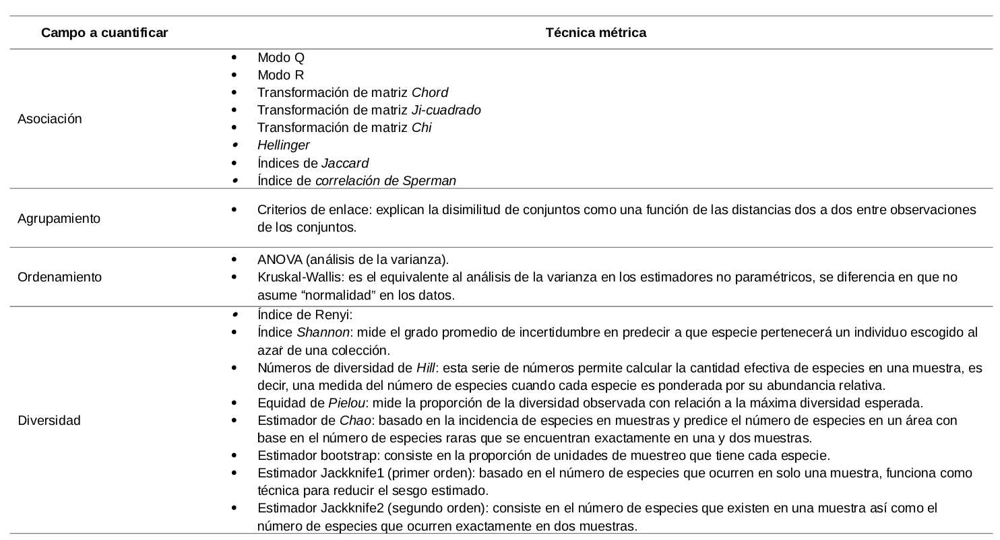
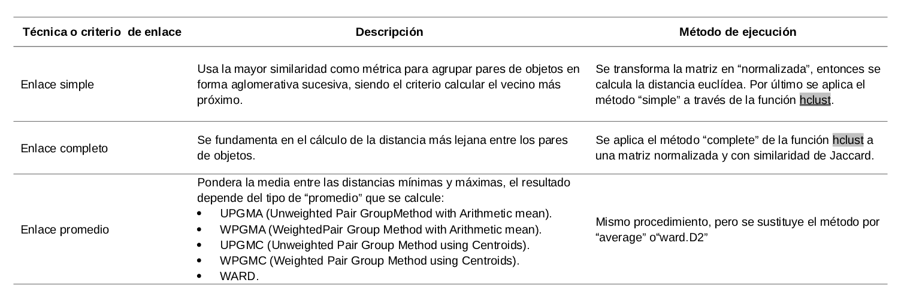
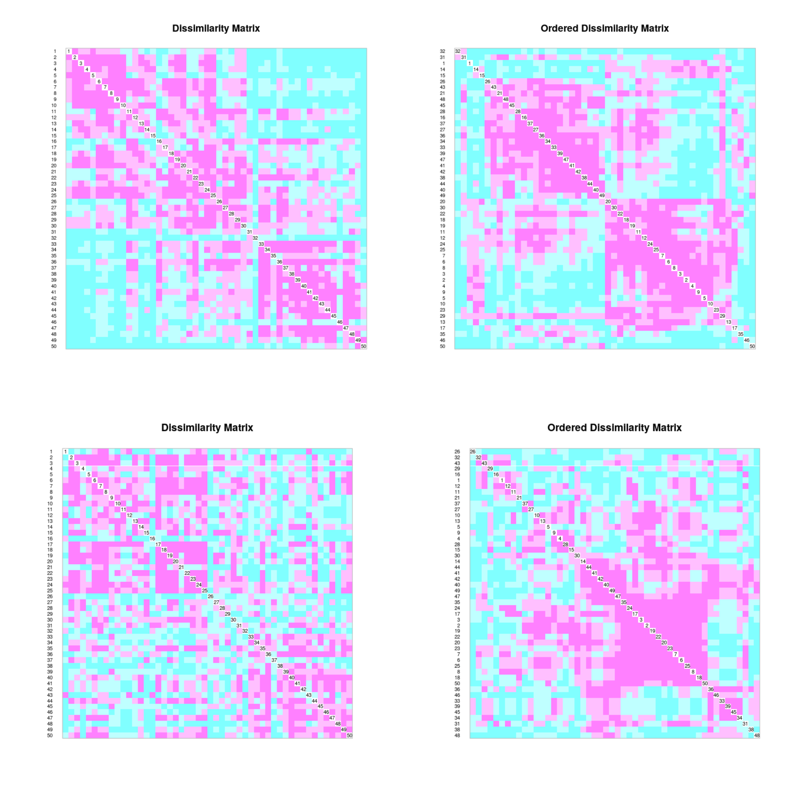
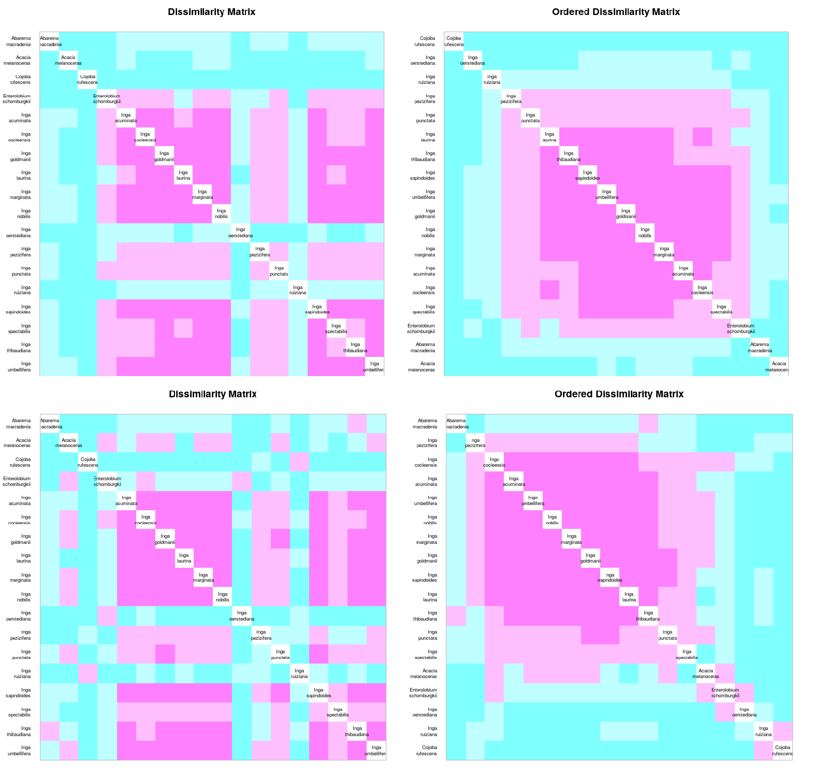
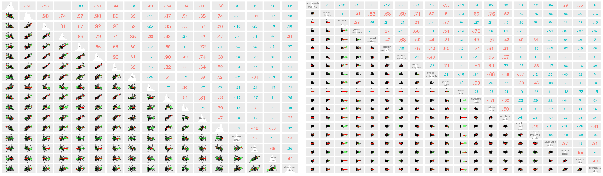
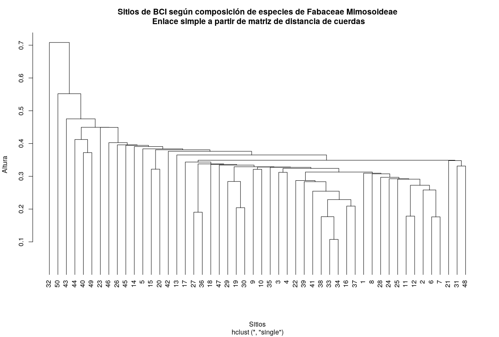
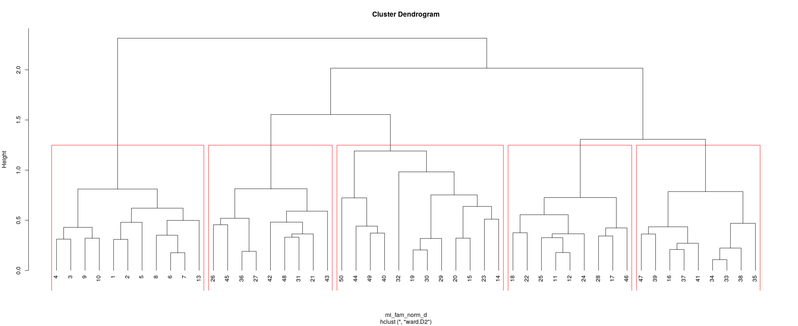
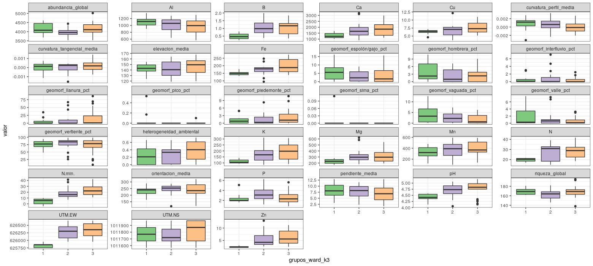
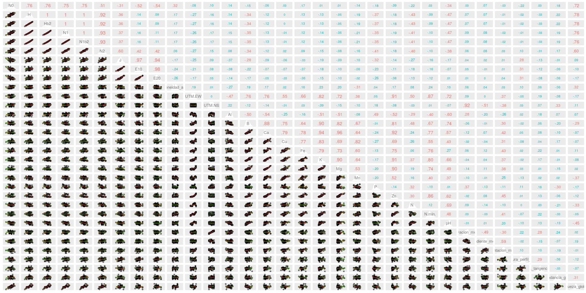

```{r, include=FALSE}
source("Cacatuo.R", local = knitr::knit_global())
```

# Introducción

El análisis de biodiversidad viabiliza la obtención de información sobre el comportamiento de las especies en su hábitat, los efectos de cambios ambientales, las probables consecuencias de actividades antrópicas en el ciclo vital de los bosques y en sus funciones.  La importancia de los bosques, especialmente los tropicales, radica precisamente en sus diversas funciones productivas (e.g. madera, fibra), ambientales (e.g. regulación del clima) y sociales (e.g. subsistencia humana, patrimonio cultural) [@montagnini2005tropical].

Las fabáceas concentran su mayor diversidad en la franja tropical y subtropical, aunque se encuentran ampliamente distribuidas por la práctica totalidad de climas terrestres. Están presentes en zonas árticas, litoral costero, ambientes alpinos, bosque lluvioso, bosque estacional, sabanas, bosque seco, desiertos áridos, pantanos y manglares. Poseen características especializadas que las hacen vitales para el equilibrio ecológico y para la supervivencia del ser humano. Asimismo, el 88% de las especies de fabáceas forman nódulos con bacterias (rhizobia) para fijar el N\textsubscript{2} en la atmósfera mediante asociación simbiótica, fisiología rica en proteínas, etc.; mientras que sus semillas son empleadas para tratar células cancerígenas, sus componentes químicos las hacen esenciales para diversos tipos de industrias, y el grano de las leguminosas representa el 33% del nitrógeno necesario en la dieta del ser humano [@saikia2020tropical]. Especificando, la subfamilia *Mimosoideae* dentro del clado filogenético mimosoide es sumamente variable, estando compuesta principalmente por árboles y arbustos de flores simétricas cigomorfas con pétalos valvados, a la vez que sus especímenes tienen un gran número de estambres prominentes [@hasanuzzaman2020plant].  


La isla Barro Colorado (9º 9' 0'' N, 79º 51' 0'' W), en lo adelante 'BCI', es una plataforma basáltica miocénica sobre la que descansa un bosque tropical primario compuesto por 305 especies arbóreas [@condit1999dynamics]. Es el emplazamiento de ocho censos forestales realizados por el Smithsonian Tropical Research Institute entre 1981 y 2015, donde la subfamilia *Fabaceae-mimosoideae* representó el 5.9% de las especies registradas en la parcela de 50 hectáreas delimitada en 1980. 

![Isla Barro Colorado, Panamá [@inproceedings].](Map-of-Barro-Colorado-Island-BCI-Panama.png){width=50%}

El registro forestal de BCI forma parte de una serie de parcelas permanentes delimitadas en distintas latitudes y longitudes, pero dentro de la zona tropical. Estas parcelas poseen diferencias climáticas específicas con el objetivo de contabilizar, supervisar y medir variables demográficas que viabilicen realizar comparaciones atendiendo a cuestionamientos científicos, registro detallado del comportamiento en ecología vegetal o problemáticas resultantes de la intervención humana en el equilibrio natural [@condit1998tropical]. 


{width=50%}


Atendiendo a la flexibilidad en la distribución de las fabáceas, su importancia económica, y social; en el presente estudio se responde a los niveles de asociación presentados por esta familia, la organización de los cuadros acorde a su composición de especies, y la probable influencia de varibales ambientales en la descripción de patrones para estos aspectos en BCI. Además, otro objetivo es realizar una estimación de la riqueza de la familia, asumiendo un 85% de riqueza o más como una 'buena representación'. La determinación de estos patrones de asociación, agrupamiento y diversidad servirán para comprender qué caracterisricas ambientales supeditan su desarrollo. En ese sentido, la ecología numérica es el campo de estudio que brinda las técnicas, índices, y herramientas necesarias para obtener conclusiones a partir de data forestal, animal, y biotopo; mientras que R es un software de código abierto y ambiente de programación que brinda una amplia variedad de facilidades para el manejo, creación, y visualización gráfica de ciencia de datos, resultando ideal para este campo de estudio [@venables2009introduction].

Los métodos de análisis en ecología numérica han incrementado exponencialmente a partir de la década 1950, desarrollándose índices, estimadores y algoritmos que permiten realizar transformaciones cualitativas y cuantitativas para inferir y obtener precisión con menores probabilidades de sesgo o en ausencia del mismo. La obtención de información relativa al grado de asociación, ordenamiento, diversidad, agrupamiento, entre otros; es debida a estas técnicas. (ver tabla \ref {tab:met})

Table 1: Métodos de análisis en ecología numérica empleados [@book].\label{tab:met}

{width=100%}


\ldots

# Metodología

La data censal de la parcela de 50Ha en BCI se obtuvo siguiendo un meticuloso proceso de clasificación de especies, tomando en cuenta solo especímenes con tallos de diametro mayor a 1 cm a la altura del pecho [@BCIdata]. Se empleó R para realizar análisis estadísticos, gráficos, matrices, y mapas a la matriz de la familia *Fabaceae-mimosoideae* partiendo del repositorio **Scripts de análisis BCI** [@jose_ramon_martinez_batlle_2020_4402362]. 

La creación de los utiles necesarios para los análisis fue posible mediante el empleo de los paquetes *vegan*, *tydiverse*, y *sf* para extraer la familia *Fabaceae-mimosoideae* de la data censal, obtener las estadísticas, gráficos lineales y diagramas de cajas. A la vez que, mediante  *mapview* se crearon, proyectaron y almacenaron los mapas; con *RColorBrewer* se para obtuvo una gama de colores más amplia en los gráficos y mapas; y con *broom* se visualizaron las matrices de distancia. Otros paquetes empleados fueron *magrittr*, *plyr*, *vegetarian* [ @vegan1; @tydiverse; @sf; @mapview; @RcolorBrewer; @broom; @magrittr; @plyr; @vegetarian].

Diversos estudios fueron tomados en cuenta para la clasificación de hábitats, se emplearon 5 de las categorías definidas por @harms2001habitat partiendo del resumen y análisis de la data compilada en 16 años, donde fueron tomados en cuenta árboles iguales o mayores de 1 cm de diámetro a la altura del pecho. (Ver tabla \ref{tab:hábitat})

Table 2: Clasificación de hábitats, parcela permanente BCI [@harms2001habitat].\label{tab:hábitat}

| Hábitat                        | Pendiente (grados) | Elevación (metros) |
|--------------------------------|:------------------:|:------------------:|
| Bosque adulto - Meseta baja    |         <7         |        <152        |
| Bosque adulto - Meseta alta    |         <7         |      = o >152      |
| Bosque adulto - Pendiente      |       = o >7       |        Todas       |
| Bosque adulto - Área pantanosa |        Todas       |        Todas       |
| Bosque joven                   |        Todas       |        Todas       |


Mapas de ubicación, abundancia de individuos, riqueza de especies, agrupamiento de parcelas, pH, nitrógeno y otras variables presentes en el relieve, clima, y edafología del lugar se emplearon para determinar patrones asociativos entre las especies.   

La determinación de la asociación interespecífica y de sitios muéstrales fue realizada mediante los métodos R y Q respectivamente. El modo Q se obtuvo con la métrica de distancia euclídea o similaridad de Jaccard, verificando la paradoja de orlóci (1978); transformando la matriz en una de cuerdas (*chord*); *ji*-cuadrado; y *Hellinger*. A lu vez, el modo R se calculó con el índice de correlación de Pearson aplicando la transformación de *chi* para corregir alteraciones producidas por outliers en los datos, convirtiendo a binaria (presencia/ausencia) la matriz de comunidad transpuesta para calcular distancias entre especies con la similaridad de Jaccard y el índice *rho* de Sperman. Por otro parte, el agrupamiento jerárquico fue analizado mediante tres técnicas o criterios de enlace (siple, UPGMA, WARD), donde fueron seleccionados los criterios enlace simple y enlace promedio de varianza mínima tomando en cuenta métodos de regresión lineal [WARD], siendo la muestra dividida en tres grupos en este último. Se descartó el método UPGMA porque los cuadros de 1Ha no formaban grupos consistentes para análisis, siendo estos "49-1" al ser dividida la muestra en dos y "48-1-1" al ser dividida en tres. (Ver tabla \ref{tab:enlace})


Table 3: Clasificación de los criterios de enlace [@harms2001habitat].\label{tab:enlace}

{width=100%}
                                                                                   |

Se evaluó si las varibales ambientales presentan efectos entre los clústers de sitios agrupados según la composición de especies por el método WARD, así como se generó la diversidad alpha aplicando la función *alpha_div* a la matriz de comunidad, obteniendo los índices, las entropías, equidades y ratios. En específico se crearon columnas con los índices N0 (Renyi), entropía H (diversidad de Shannon), Hb2 (entropía de Shannon en base =2), los números de diversidad de Hill (N1, Nb2, N2), J (equidad de Pielou), y las dos ratios de Hill (E10 y E20).

Para obtener la estimación de riqueza de acuerdo a la diversidad de especies en la parcela se emplearon los estimadores no paramétricos o de "distribución libre", entre estos están Chao1, Bootstrap, y los Jackknife1 de primer y segundo orden. 


# Resultados

La parcela de 50 héctareas de BCI posee 3847 individuos de la familia *Fabaceae mimosoideae* agrupados en 18 especies distribuidas de forma aleatoria en 50 sitios de 1ha cada uno. La especie más abundante es *Inga marginata* (767 individuos), seguida de cerca por *Inga umbellifera* (765 individuos); mientras que la más escasa es *Cojoba rufescens* (2 individuos), seguida de *Inga oerstediana* (4 individuos). La abundancia de especies presenta una mediana de 57 individuos [*Inga punctata* e *Inga laurina*], representando la mitad de especies menos abundante el equivalente a un 5.82% de la abundancia total (224 individuos) y la mitad más presente el 94.18% (3623 individuos). La riqueza de especies por cuadro de 1 Ha en BCI, en lo adelante 'Cxx' para cuadros específicos, evidencia una distribución también desigual, el C26 presenta la riqueza más débil (5 especies) y el C30 la más fuerte (13 especies). (ver tabla \ref{tab:abun_sp} y figura \ref{fig:abun_sp_q})

```{r, echo=FALSE}
knitr::kable(abun_sp,
             longtable = FALSE,
             caption = "\\label{tab:abun_sp}Abundancia por especie de la familia *Fabaceae-Mimosoideae*.")
```

```{r, echo=FALSE, fig.cap="\\label{fig:abun_sp_q}Abundancia por especie por quadrat"}
abun_sp_q
```

La forma del terreno predominante es la vertiente, siendo esta característica la más destacada en el 88% de los cuadros; en tanto que el 12% restante describe una geomorfología donde predomina el relieve llano. La parcela de 50 Ha está compuesta en un 52% por bosque adulto en meseta baja distribuido ampliamente, un 24% por bosque adulto en pendiente con presencia marcada en las parcelas de C41 a C45, un 16% por bosque adulto en meseta alta concentrado en las parcelas de C32 a C34 y C37 a C40, mientras que el 8% restante es hábitat pantanoso y bosque joven en forma equitativa.

La asociación entre sitios, medida a partir de la distancia euclídea calculada a partir de una matriz de comunidad transformada por el método Hellinger, así como a partir de la distancia Jaccard calculada a partir de una matriz de comunidad binaria, sugiere la existencia de clústers sumamente semejantes limitados por los sitios C28-C33; C33-C40; C24-C2; C8-C10. Estos sitios comparten un 75% o más de las especies de acuerdo con la matriz ordenada en función de la relación de proximidad (ver mapa de calor superior, figura \ref{fig:heat}). Por otra parte, existe una relación [inversa/directa] entre las variables edáficas y la abundancia de especies en el clúster formado por los sitios C1-C9 de la matriz ordenada en función del id de lugar, pero además de esta relación no hay indicios de una dependencia entre estas variables que evidencie asociación alguna (ver mapa de calor inferior \ref{fig:heat}). De igual forma, no existe una relación de asociación entre las variables mixtas "hábitat, quebrada, heterogeneidad ambiental" y la distribución de especies por cuadros. (Ver figura \ref{fig:heat}).

{width=100%}


La asociación interespecífica en función de la abundancia, como se observa en el mapa de calor \ref{fig:heat1}, evidencia un grado de asociación muy amplio (75%-100%) en el clúster delimitado por *Inga lauriana* e *Inga margitana*, así como uno considerable en el macroclúster comprendido entre *Inga pezizifera* e *Inga spectabilis*. Es descrito un patrón similar por las especies en la matriz binaria (presencia/ausencia), donde se forma un clúster entre *Inga cocleensis* e *Inga laurina* que describe bastante coexistencia entre las especies (75%-100%), y un macroclúster entre *Inga pezizifera* e *Inga spectabilis* con cercanía considerable. En ese sentido, la matriz de correlación entre las variables "abundancia, riqueza, y composición del suelo" , realizada mediante el índice *rho* de sperman, corrobora lo observado en los mapas de calor anteriores acerca del escaso grado de asosiación entre dichas variables. Tampoco se observa relación entre las dos primeras y las variables relativas a la geomorfología del lugar. (Ver figura \ref{fig:sper})


{width=100%}

{width=100%}


Acorde al ordenamiento por enlace simple, los cuadros 32, 50 y 43 se separan bastante de los demás, lo cual se corresponde con la abundancia y riqueza de especies en estos sitios comparada con los demás, siendo en C32 116 [tercera más alta] y 8 [tercil más pobre] respectivamente, por ejemplo. También se observan dos grupos definidos formados entre los sitios C22-C37 y C28-C7. (Ver \label{fig:denS})

{width=100%}


En el dendrograma de WARD se observa la presencia de tres grupos definidos entre los sitios C3-C7, C46-C34 y C27-C23; formados por 11, 18 y 21 sitios respectivamente. También pueden definirse cinco subgrupos menores más próximos entre sí: C3-C7 [sitios con abundancia y riqueza promedio], C46-C22, C27-C48, C50-C23 [citios con las mayores abundancias y riquezas, o al menos una de estas en forma de outlier] (ver figura\ref{fig:denW}).Continuando con los tres primeros grupos WARD mencionados, en los diagramas de cajas para las variables ambientales se observa distancia que se acrecienta según  se cambia de grupo, en orden ascendente, en las medianas respecto a las variables Boro, Hierro, Geomorfología en llanura,  Potasio, Nitrógeno Mínimo, pH y zinc. Esta tendencia es también descrita en menor medida por las variables Calcio, Cobre, Heterogeneidad ambiental y Magnesio. En contraste, este patrón se invierte en las variables Aluminio y Geomorfología en vaguada. Por otra parte, el segundo grupo se decanta por la variable Fósforo, presentando números inferiores en Abundancia y Riqueza de especies, mientras que el primer y tercer grupo son bastante homogéneos en ese sentido.     

{width=100%}

{width=100%}


En la matriz de correlación para determinar equidad se observan niveles de correlación bastante bajos para todas las variables ambientales, siendo las variables Boro, Fósforo, Nitrógeno y pH las que presentan niveles significativos respecto a los números de Hill y los índices de Shannon. Por otra parte, la variable "Riqueza global" presenta niveles determinantes para los índices anteriores, promediando un 73% de correlación colectivamente. 

{width=100%}


La riqueza de especies respecto a la diversidad de estas en la parcela se determinó en porcentajes aproximados a la riqueza real. Por otro lado, la diversidad beta describe una curva ascendente según aumenta el número de ordenamiento en Hill, llegando a superar el N0. Presentando un grado de dominancia mayor y una dependencia de la abundancia en la diversidad beta. Las especies que más contribuyen a la diversidad son *Inga acumiata*, *Inga marginata*, *Inga Pezizifera* e *Inga thibaudiana*; donde las dos primeras son de las especies más abundantes y por si solas representan el 35.7% de los individuos en la comunidad de las fabáceas. Por otra parte, los sitios que más contribuyen a la diversidad beta son C32 y C50. (Ver tabla \ref{tab:est})

Table 4: Estimadores de riqueza de especies. \label{tab:est}

| Estimadores | Chao      | Jackknife1 | Jackknife2     | Bootstrap           | Real |
|-------------|-----------|------------|----------------|----------------|------|
|             | 18 (100%) | 18 (100%)  | 17.06 (105.5%) | 18.19 (98.95%) | 18   |


# Discusión

La familia *Fabaceae mimosoideae* en BCI presenta niveles de asociación (coexistencia) sobre el 75% entre las especies *Inga laurina*, *Inga margitana*, *Inga thitaudiana*, *Inga sapindoides*, *Inga umbellifera*, *Inga goldimanii* e *Inga nobilis*. Estas especies son las más abundantes de esta familia en BCI, exceptuando por *Inga laurina* que tomando en cuenta sus apenas 57 individuos se encuentra ampliamente distribuida. Ninguna variable ambiental resultó determinante en la existencia de especies en los cuadros, aunque existen relaciones significativas entre las variables edáficas Al [grupo 1], K [grupo 2], pH y Zn [grupo 3].

La composición de las fabáceas es bastante uniforme tomando en cuenta que a través del criterio de enlace promedio UPGMA no se pudo dividir las muestras de forma efectiva en dos grupos [resultando en 49 y 1]. Sin embargo, mediante el método promedio de la varianza mínima se pudo separar efectivamente la muestra en tres grupos de cuadros, los cuales presentaron medianas bastante aproximadas entre sí para la mayoría de variables ambientales.

La diversidad de las especies no está afectada de forma significativa por alguna variable, siendo la equidad poco significativa para todas las variables ambientales, exceptuando por la abundancia global que es la determinante de la diversidad en la muestra. En ese sentido, la riqueza las fabáceas respecto a la diversidad es bastante alta, teniendo porcentajes mayores al 98% en todos los índices calculados. Cuatro especies contribuyen significativamente a la dversidad: *Inga marginata*, *Inga acumiata*, *Inga thibaudiana* e *Inga Pezizifera*, todas ellas pertenecientes a la mitad más abundante de las especies.


# Agradecimientos

Este trabajo fue posible gracias al Ph.D José Ramón Martinez Battle, quien supervisó todo el proceso, brindó la asesoría y fuentes bibliográficas que sirvieron de base para la elaboración del estudio.

# Información de soporte

\ldots

# *Script* reproducible

# Bibliografía

\ldots


