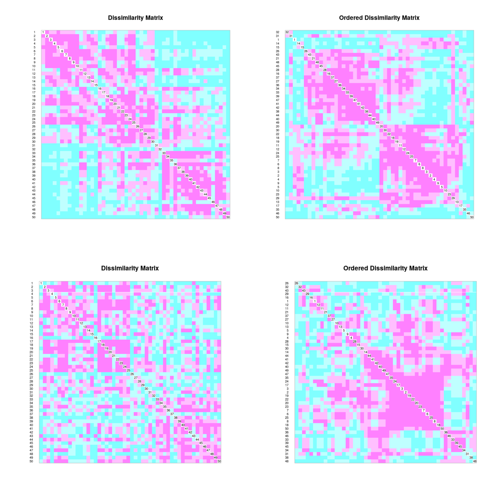
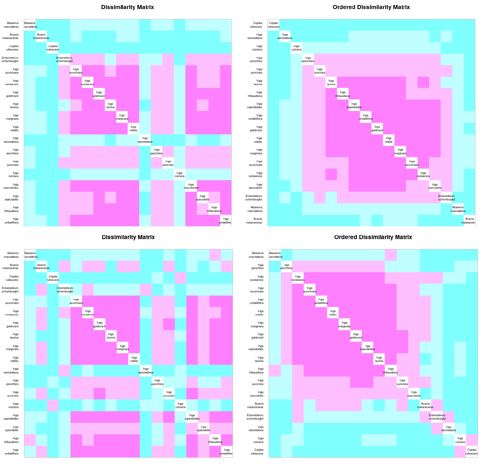
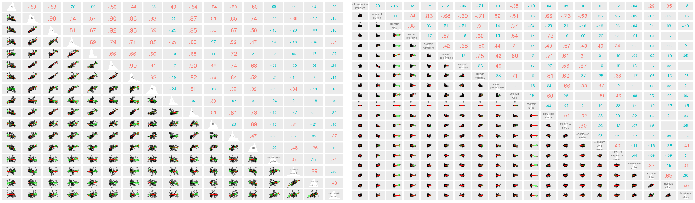

```{r, include=FALSE}
source("Cacatuo.R", local = knitr::knit_global())
```

# Introducción

El análisis de biodiversidad forestal viabiliza la obtención de información sobre el comportamiento de las especies en su hábitat, los efectos de cambios geoestacionarios, y las probables consecuencias de actividades antrópicas en el ciclo vital de los bosques; cuya función en el caso de los tropicales puede ser productiva (madera, fibra, leña, productos no maderables); ambiental (regulación del clima, reserva de biodiversidad, conservación de suelos y agua, etc.); y social (subsistencia de poblamientos humanos locales y su cultura) [@montagnini2005tropical].

La isla Barro Colorado (BCI), de coordenadas [9º 9' 0'' N, 79º 51' 0'' W], es una plataforma basáltica miocénica sobre la que descansa un bosque tropical primario compuesto por 305 especies arbóreas  [@condit1999dynamics]. Fue el emplazamiento de ocho censos forestales realizados por el Smithsonian Tropical Research Institute entre 1981 y 2015, donde la subfamilia *Fabaceae Mimosoideae* representó el 5.9% de las especies registradas en la parcela de 50 hectáreas delimitada en 1980. 

![Isla Barro Colorado, Panamá [@inproceedings].](Map-of-Barro-Colorado-Island-BCI-Panama.png){width=50%}

El registro forestal de BCI forma parte de una serie de parcelas permanentes delimitadas en distintas latitudes y longitudes, pero dentro de la zona tropical. Estas parcelas poseen diferencias climáticas específicas con el objetivo de contabilizar, supervisar y medir variables demográficas que viabilicen realizar comparaciones atendiendo a cuestionamientos científicos, registro detallado del comportamiento en ecología vegetal o problemáticas resultantes de la intervención humana en el equilibrio natural [@condit1998tropical]. 


{width=50%}

Las fabaceas concentran su diversidad en la franja tropical y subtropical, aunque se encuentran ampliamente distribuidas por la práctica totalidad de climas terrestres. Están presentes en zonas árticas, litoral costero, ambientes alpinos, bosque lluvioso, bosque estacional, sabanas, bosque seco, desiertos áridos, pantanos y manglares. Poseen características especializadas que las hacen vitales para el equilibrio ecológico y para la supervivencia del ser humano. Asimismo, el 88% de las especies de fabaceas pueden formar nódulos con bacterias (rhizobia) para fijar el N2 en la atmósfera mediante asociación simbiótica, fisiología rica en proteínas, etc.; mientras que sus semillas son empleadas para tratar células cancerígenas, sus componentes químicos las hacen esenciales para diversos tipos de industrias, y el grano de las leguminosas representa el 33% del nitrógeno necesario en la dieta del ser humano [@saikia2020tropical]. Especificando, la subfamilia *Mimosoideae* dentro del clado filogenético mimosoide es sumamente variable, estando compuesta principalmente por árboles y arbustos de flores simétricas cigomorfas con pétalos valvados, a la vez que sus especímenes tienen un gran número de estambres prominentes [@hasanuzzaman2020plant]. En BCI se encuentran 18 de estas especies.  


{width=50%}


Atendiendo a la flexibilidad en la distribución de las fabáceas, su importancia económica, y social; se busca entender qué factores ambientales intervienen en la proliferación, agrupamiento o decaimiento de sus poblaciones en bosques tropicales que comparten características con los hallados en República Dominicana, en esta ocasión tomando la data cincuentenaria recolectada y provista por The Center for Tropical Forest Science en BCI. En ese sentido, la ecología numérica es el campo de estudio que brinda las técnicas, índices, y herramientas necesarias para obtener conclusiones a partir de data forestal, animal, y biotopo. R es un software de código abierto y ambiente de programación que brinda una amplia variedad de facilidades para el manejo, creación, y visualización gráfica de ciencia de datos, resultando ideal para este campo de estudio [@venables2009introduction].

Los métodos de análisis en ecología númerica han incrementado exponencialmente a partir de la década 1950, desarrollandose índices, estimadores y algoritmos que permiten realizar transformaciones cualitativas y cuantitativas para inferir y obtener presición con menores probabilidades de sesgo o en ausencia del mismo. La obtención de información relativa al grado de asociación, ordenamiento, diversidad, agrupamiento, entre otros; es debida a estas técnicas. (ver tabla \ref {tab:met})

Table 1: Métodos de análisis en ecología numérica empleados [@Moreno2001].\label{tab:met}
.png){width=100%}


\ldots

# Metodología

Obtenida la data censal de Barro Colorado, se empleó R para realizar análisis estadísticos, gráficos, matrices, y mapas a la matriz de la familia *Fabaceae mimosoideae* partiendo del repositorio **Scripts de análisis BCI** [@jose_ramon_martinez_batlle_2020_4402362]. 

La creación de los utiles necesarios para los análisis fue posible mediante el empleo de los paquetes *vegan*, *tydiverse*, y *sf* para extraer la familia *Fabaceae Mimosoideae* de la data censal, obtener las estadísticas, gráficos lineales y diagramas de cajas. A la vez que, mediante  *mapview* se crearon, proyectaron y almacenaron los mapas; con *RColorBrewer* se para obtuvo una gama de colores más amplia en los gráficos y mapas; y con *broom* se visuaizaron las matrices de distancia. Otros paquetes empleados fueron *magrittr*, *plyr*, *vegetarian*.

***Podría crear una tabla para explicar brevemente el uso dado a cada paquete***

La caracterización geomorfológica se elaboró a partir del algoritmo r.geomorphons siguiendo el modelo de @jasiewicz2013geomorphons. (Ver figuras \ref{Geomorf3} y \ref{Geomorf2}) 

{width=75%}

{width=75%}


Diversos estudios fueron tomados en cuenta para la clasificación de hábitats, se emplearon 5 de las categorías definidas por @harms2001habitat partiendo del resumen y análisis de la data compilada en 16 años, donde fueron tomados en cuenta árboles iguales o mayores de 1 cm de diámetro a la altura del pecho. (Ver tabla \ref{tab:hábitat})


Table 2: Clasificación de hábitats, parcela permanente BCI [@harms2001habitat].\label{tab:hábitat}

| Hábitat                        | Pendiente (grados) | Elevación (metros) |
|--------------------------------|:------------------:|:------------------:|
| Bosque adulto - Meseta baja    |         <7         |        <152        |
| Bosque adulto - Meseta alta    |         <7         |      = o >152      |
| Bosque adulto - Pendiente      |       = o >7       |        Todas       |
| Bosque adulto - Área pantanosa |        Todas       |        Todas       |
| Bosque joven                   |        Todas       |        Todas       |


Mapas de ubicación, abundancia de individuos, riqueza de especies, agrupamiento de parcelas, pH, nitrógeno y otras variables presentes en el relieve, clima, y edafología del lugar se emplearon para determinar patrones asociativos entre las especies.   

La determinación de la asociación interespecífica y de sitios muestrales fue ralizada mediante los métodos R y Q respectivamente. El modo Q se obtuvo con la métrica de distancia euclidea o similaridad de Jaccard, verificando la paradoja de orlóci (1978);  transformando la matriz en una de cuerdas (*chord*); *ji*-cuadrado; y *Hellinger*. A lu vez, el modo R se calculó con el índice de correlación de Pearson aplicando la transformación de *chi* para corregir alteraciones producidas por outliers en los datos, convirtiendo a binaria (presencia/sencia) la matriz de comunidad transpuesta para calcular distancias entre especies con la similaridad de Jaccard y el índice *rho* de Sperman. Por otro parte, el agrupamiento jerárquico fue analizado mediante tres técnicas o criterios de enlace, donde fueron seleccionados los criterios enlace simple y enlace promedrio de varianza mínima tomando en cuenta métodos de regresión lineal [WARD], siendo la muestra dividida en tres grupos en este último.


Table 3: Clasificación de hábitats, parcela permanente BCI [@harms2001habitat].\label{tab:hábitat}

.png){width=100%}
                                                                                   |

Se realizó una correlación entre los tres grupos determinados para WARD y las variables ambientales para definir posibles asociaciones entre estos o la exitencia de un grupo que se decante por al menos una varibale en específico, fueron empleadas las pruebas ANOVA para evaluar homogeneidad de medias y Kruskal-Wallis para evaluar homogeneidad de medianas. De igual forma, fue generada la diversidad alpha aplicando la función *alpha_div* a la matriz de comunidad, transformandola en una matriz de índices, entropías, equidades y ratios. En específico se crearon columnas con los índices N0 (Renyi), entropía H (diversidad de Shannon), Hb2 (entropía de Shannon en base =2), los números de diversidad de Hill (N1, Nb2, N2), J (equidad de Pielou), y las dos ratios de Hill (E10 y E20).

Para obtner la estimación de riqueza de acuerdo a la diversidad de especies en la parcela se emplearon los estimadores no paramétricos o de "distribución libre", entre estos están Chao1, Bootstrap, y los Jackknife1 de primer y segundo orden. 

\ldots

# Resultados

La parcela madre en BCI posee 3847 individuos de la familia *Fabaceae mimosoideae* agrupados en 18 especies distribuidas de forma aleatoria en 50 sitios de 1ha cada uno. La especie más abundante es *Inga marginata* [767], seguida de cerca por *Inga umbellifera* [765]; mientras que la más escasa es *Cojoba rufescens* [2], seguida de *Inga oerstediana* [4]. La abundancia especifica acorde a una organización ascendente por número de individuos presenta una mediana de 57 individuos [*Inga punctata* e *Inga laurina*], siendo la mitad más pobre de especies el equivalente a un 5.82% [224] y la mitad más presente el 94.18% [3623]. La riqueza de especies por cuadrante evidencia una distribución también desproporcional, el C26 presenta la riqueza más débil [5] y el C30 la más fuerte [13]. No obstante, aunque no existe relación directa entre la riqueza y la abundancia por cuadrante, en C26 coíncide y en algunos otros cuadros puede existir cierta aproximación.

(ver tabla \ref{tab:abun_sp} y figura \ref{fig:abun_sp_q})

```{r, echo=FALSE}
knitr::kable(abun_sp,
             longtable = FALSE,
             caption = "\\label{tab:abun_sp}Abundancia por especie de la familia *Fabaceae-Mimosoideae*.")
```

```{r, echo=FALSE, fig.cap="\\label{fig:abun_sp_q}Abundancia por especie por quadrat"}
abun_sp_q
```

El terreno eminentemente describe una geomorfología en vertiente, siendo esta característica la más destacada en el 88% de los C 1Ha; en tanto que el 12% restante describe una geomorfología donde predomina el relieve llano. La parcela madre está compuesta en un 52% por bosque adulto en meseta baja distribuido ampliamente, un 24% por bosque adulto en pendiente con presencia marcada en las parcelas [C41-C45], un 16% por bosque adulto en meseta alta concentrado en las parcelas [C32-C34; C37-C40], mientras que el 8% restante es hábitat pantanoso y bosque jovén en forma equitativa. No parece existir una relación directa entre la morfología del espacio y un determinado hábitat, exeptuando el bosque joven que se encuentra tanto en llanura como en vertiente de forma considerable. En general, se percibe un leve aumento de la riqueza específica a medida que aumenta la abundancia de individuos; destacando la abundante riqueza de especies en el hábitat pantanoso, su pobreza en el bosque adulto en zona alta, la abundancia marcada el bosque adulto en zona baja y su riqueza equilibrada . (Ver figura \ref{fig:leal}).


.png){width=100%}


El grado de asociación según la similaridad de Jaccard acorde a la abundancia de especies por cuadro con matriz transformada *Hellinger* expone la existencia de clústers super semejantes limitados por los sitios C28-C33; C33-C40; C24-C2; C8-C10. Estos sitios comparten un 75% o más de las especies de acuerdo con la matriz ordenada en función de la relación de proximidad (ver mapa de calor superior \ref{fig:heat}). Por otra parte, la presencia de variables edáficas como minerales y otros elementos está asociada a la abundancia de especies en el clúster formado por los sitios C1-C9 de la matriz ordenada en función del id de lugar, pero además de esta relación no hay indicios de una dependencia entre estas variables que evidencie asociación alguna (ver mapa de calor inferior \ref{fig:heat}). De igual forma, no existe una relación de asociación entre las variables mixtas "hábitat, quebrada, heterogeneidad ambiental" y la distribución de especies por cuadros. (Ver figura \ref{fig:heat).

{width=50%}


La asociación interespecífica en función de la abundancia, como se observa en el mapa de calor número 5, evidencia un grado de asociación muy amplio [75%-100%] en el clúster delimitado por *Inga lauriana* e *Inga margitana*, así como uno considerable en el macroclúster comprendido entre *Inga pezizifera* e *Inga spectabilis*. Es descrito un patrón similar por las especies en la matriz binaria (presencia/ausencia), donde se forma un clúster entre *Inga cocleensis* e *Inga laurina* que describe bastante coexistencia entre las especies [75%-100%], y un macroclúster entre *Inga pezizifera* e *Inga spectabilis* con cercanía considerable. En ese sentido, la matriz de correlación entre las variables "abundancia, riqueza, y composición del suelo" ,realizada mediante el índice *rho* de sperman, corrobora lo observado en los mapas de calor anteriores acerca del escaso grado de asosiación entre dichas variables. Tampoco se observa relación entre las dos primeras y las variables relativas a la geomorfología del lugar.


{width=100%}

{width=100%}rtf

{width=100%}

***Insertar mapa de calor 1 y 2 . aa_3_modo_R***
***Insertar matriz correlación Sperman 1 y 2 . aa_3_modo_R***


Acorde al ordenamiento por enlace simple, los cuadros 32, 50 y 43 se separan bastante de los demás, lo cual se corresponde con la abundancia y riqueza de especies en estos sitios comparada con los demás, siendo en C32 116 [tercera más alta] y 8 [tercil más pobre] respectivamente, por ejemplo. También se observan dos grupos definidos formados entre los sitios C22-C37 y C28-C7.

***Insertar ordenamiento por enlace simple***

En el dendrograma de WARD se observa la presencia de de tres grupos definidos entre los sitios C3-C7, C46-C34 y C27-C23; formados por 11, 18 y 21 sitios respectivamente. También pueden definirse cinco subgrupos menores más próximos entre sí: C3-C7 [sitios con abundacia y riqueza promedio], C46-C22, C27-C48, C50-C23 [citios con las mayores abundancias y riquezas, o al menos una de estas en forma de outlier].Continuando con los tres primeros grupos WARD mencionados, en los diagramas de cajas para las variables ambientales se observa distancia que se acrecenta según  se cambia de grupo, en orden ascendente, en las medianas respecto a las variables Boro, Hierro, Geomorfología en llanura,  Potasio, Nitrógeno Minimo, pH y zinc.Esta tendencia es también descrita en menor medida  por las variables Calcio, Cobre, Heterogeneidad ambiental y Magnesio. En constrate, este patrón se invierte en las variables Aluminio y Geomorfología en vaguada. Por otra parte, el segúndo grupo se decanta por la variable Fósforo, presentando números inferiores en Abundancia y Riqueza de especies, mientras que el primer y tercer grupo son bastante homogéneos en ese sentido.     
***Insertar boxplot agrupamiento WARD***
***Insertar mapas de grupos WARD y relación con variable Al***

En la matriz de correlación para determinar equidad se observan niveles de correlación bastante bajos para todas la variables ambientales, siendo las variables Boro, Fósforo, Nitrógeno y pH las que presentan niveles significativos respecto a los números de Hill y los índices de Shannon, más no tanto como para ser considerados determinantes de la diversidad de especies de manera amplia en la muestra. Por otra parte, la variable "Riqueza global" presenta niveles determinantes para los índices anteriores, promediando un 73% de correlación de manera colectiva. 

***Insertar matriz 2, análisis diversidad alpha***

La riqueza de especies respecto a la diversidad de estas en la parcela se determinó en porcentajes aproximados a la riqueza real. Por otro lado, la diversidad beta describe una curva ascendente según aumenta el número de ordenamiento en Hill, llegando a superar el N0. Presentando un grado de dominancia mayor y una dependencia de la abundancia en la diversidad beta. Las especiees que más contribuen a la diversidad son *Inga acumiata*, *Inga marginata*, *Inga Pezizifera* e *Inga thibaudiana*; donde las dos primeras son de las especies más abundantes y por si solas representan el 35.7% de los individuos en la comunidad de las fabaceas. Por otra parte, los sitios que más contribuyen a la diversidad beta son C32 y C50. (Ver tabla \ref{tab:est})

Table 4: Estimadores de riqueza de especies. \label{tab:est}

| Estimadores | Chao      | Jackknife1 | Jackknife2     | Bootstrap           | Real |
|-------------|-----------|------------|----------------|----------------|------|
|             | 18 (100%) | 18 (100%)  | 17.06 (105.5%) | 18.19 (98.95%) | 18   |


# Discusión

La familia *Fabaceae mimosoideae*

# Agradecimientos

# Información de soporte

\ldots

# *Script* reproducible


\ldots

