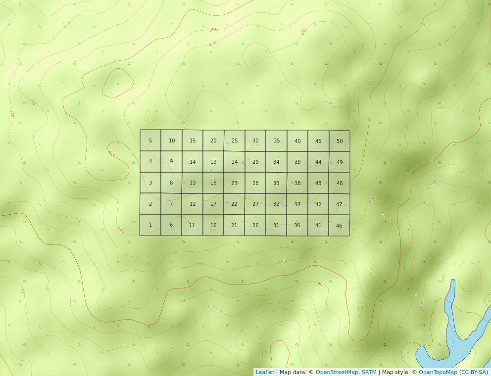
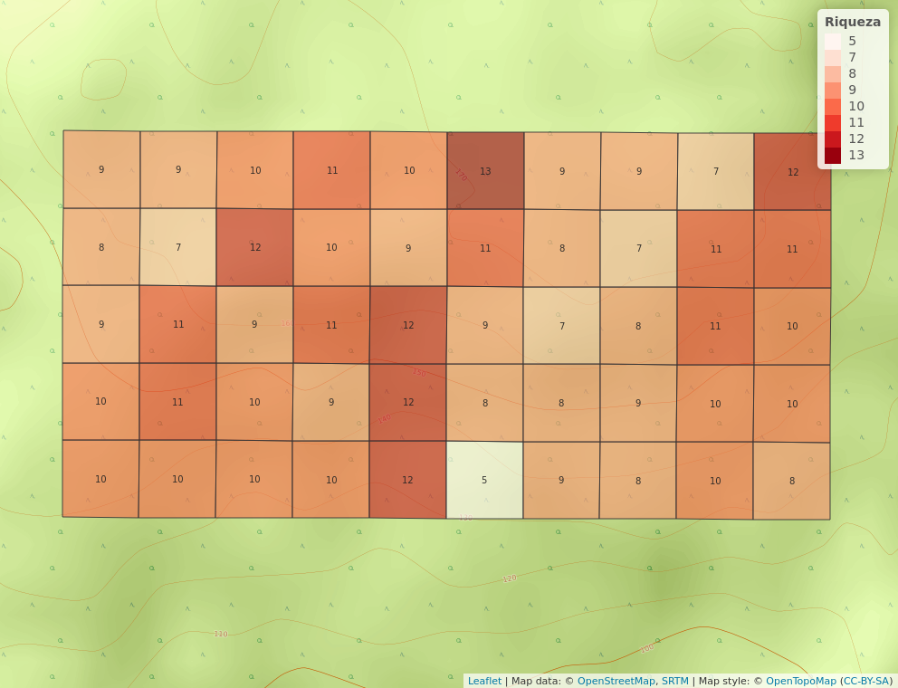

```{r, include=FALSE}
source("Cacatuo.R", local = knitr::knit_global())
```

# Introducción

El análisis de biodiversidad forestal viabiliza la obtención de información sobre el comportamiento de las especies en su hábitat, los efectos de cambios geoestacionarios, y las probables consecuencias de actividades antrópicas en el ciclo vital de los bosques. La función de los bosques tropicales puede ser productiva (madera, fibra, leña, productos no maderables); ambientales (regulación del clima, reserva de biodiversidad, conservación de suelos y agua, etc.); y social (subsitencia de poblamientos humanos locales y su cultura) [@montagnini2005tropical].

La isla Barro Colorado, de coordenadas [9º 9' 0'' N, 79º 51' 0'' W], es una plataforma basáltica miocénica sobre la que descansa un bosque tropical primario compuesto por 305 especies arboreas  [@condit1999dynamics]. En el período 1981-2015 fue el emplazamiento de ocho censos forestales realizados por el Smithsonian Tropical Research Institute, donde la subfamilia *Fabaceae Mimosoideae* representa el 5.9% de las especies registradas en la parcela de 50 hectareas delimitada en 1980 [Cita3,WebP]. 

El registro forestal en la isla Barro colorado forma parte de una serie de parcelas  delimitadas en distintas latitudes y longitudes, pero dentro de la zona tropical. Las parcelas poseen diferencias climiáticas específicas con el objetivo de contabilizar, supervisar y medir variables demográficas qeue viabilicen realizar comparaciones atendiendo a cuestionamientos científicos, registro detalldo del comportamiento en ecología vegetal o problemáticas resultantes de la intervención humana en el equilibrio natural [@condit1998tropical]. 


{width=50%}

Las fabaceas se encuentran ampliamente distribuidas por la practica totalidad de climas terrestres, concentrando su diversidad en la franja tropical y subtropical. Están presentes en zonas árticas, litoral costero, ambientes alpinos, bosque lluvioso, bosque estacional, sabanas, bosque seco, desiertos áridos, pantanos y manglares. Poseen caracteristicas especializadas que las hacen vitales para el equilibrio ecológico y para la supervivencia del ser humano. El 88% de las especies de esta familia pueden formar nódulos con bacterías fijadoras de nitrógeno (rhizobia) para fijar el N2 en la atomosfera mediante una asociación simbiótica, fisiología rica en proteínas,etc. Asimismo, sus semillas son empleadas para tratar celulas cancerigenas, sus compotenentes químicos las hacen esenciales para diversos tipos de industrias, y el grano de las leguminosas representa por si solo el 33% del nitrogeno necesario en la dieta de los seres humanos [@saikia2020tropical].    

La familia *Mimosoideae* dentro del clado mimosoide es una subfamilia sumamente variable; compuesta principalmente por árboles y arbustos de flores asimétricas cigomorfas. El clado filogenético mimosoide es propio de climas tropicales y subtropicales, sus flores son simétricas con petalos valvados y sus especimenes tienen un gran número de estambres prominentes [@hasanuzzaman2020plant]. En BCI se encuentran 18 de estas especies. 

```{r, echo=FALSE}
knitr::kable(abun_sp,
             caption = "\\label{tab:abun_sp}Abundancia por especie de la familia *Fabaceae-Mimosoideae*.")
```

Atendiendo a la flexibilidad en la distribución de las fabaceas, su importancia económica, y social; se busca entender qué factores ambientales intervienen en la proliferación, agupamiento o decaimiento de sus poblaciones en bosques tropicales que comparten características con los hallados en República Dominicana, en esta ocasión tomando la data cincuentenaria recolectada y provista por The Center for Tropical Forest Science en BCI.


\ldots


# Metodología

Una vez obtenida la data censal de Barro Colorado, se crearon mapas de distribución, agrupamiento, asociación y riqueza. Estos mapas de carcterización de la parcela se emplearon en comparaciones con variables presentes en el relieve, clima y edafología del lugar.  Se seleccionó la subfamilia *Fabaceae Mimosoideae* dentro del total de 59 familias registradas.

Los mapas fueron procsados mediante técnicas de ecología numérica analizadas en R.


Fueron realizados análisis a todas 

{width=50%}

\ldots

# Resultados


(ver tabla \ref{tab:abun_sp} y figura \ref{fig:abun_sp_q})

```{r, echo=FALSE}
knitr::kable(abun_sp,
             caption = "\\label{tab:abun_sp}Abundancia por especie de la familia *Fabaceae-Mimosoideae*.")
```

```{r, echo=FALSE, fig.cap="\\label{fig:abun_sp_q}Abundancia por especie por quadrat"}
abun_sp_q
```

# Discusión

# Agradecimientos

# Información de soporte

\ldots

# *Script* reproducible

\ldots

# Referencias
